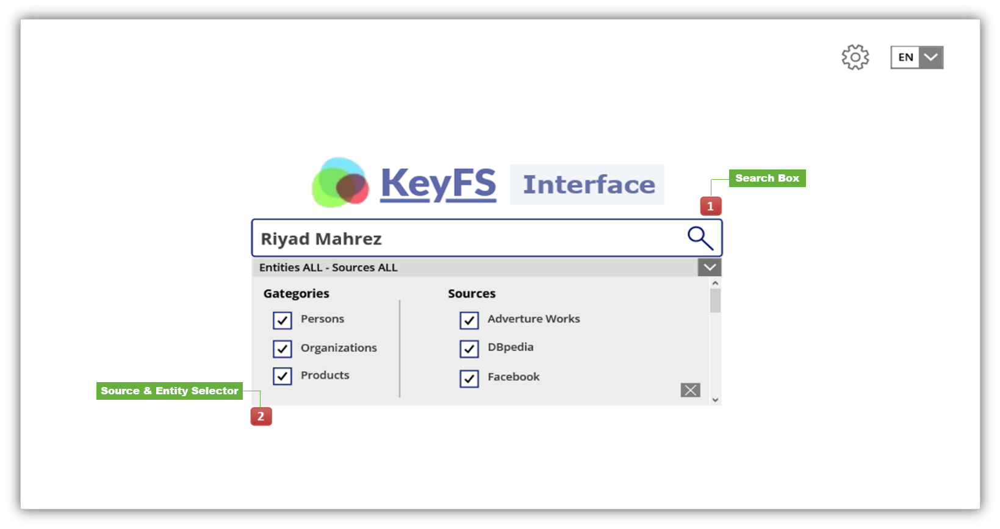
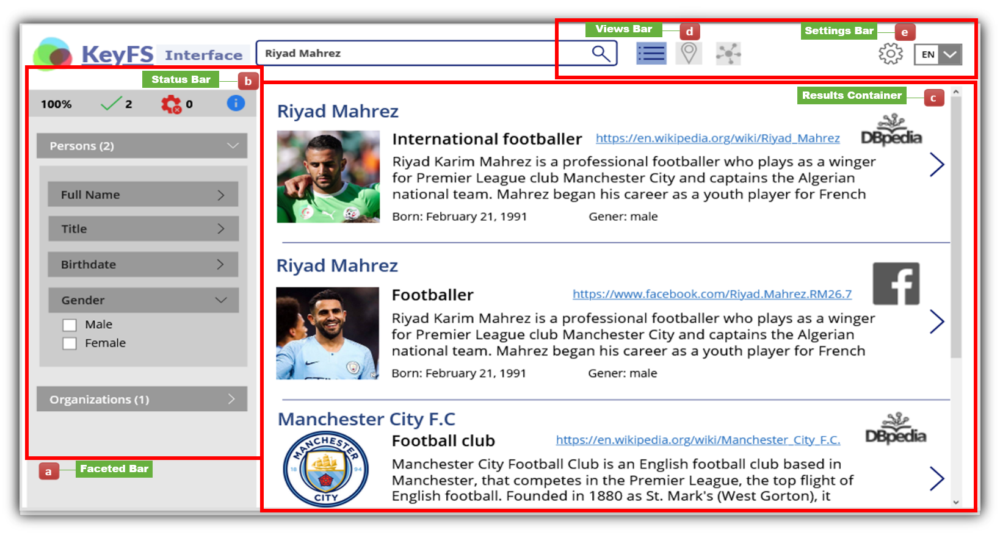

# KeyFS Faceted Navigation Interface
KeyFS: Keyword-based Faceted Search over integrated data. The engine in KeyFS is based on our MidSemI middleware and our KGMap semantic mapping approach. KeyFS is equipped with a reactive faceted browsing interface designed to facilitate the exploration of integrated data behind the knowledge graph.
We have configured KeyFS to explore three datasets: the AdventureWorks CRM database, DBpedia, and the Facebook API. Figure 1 shows the main KeyFS interface.  
Figure 2 shows the results using "Riyad Mahrez" as the keyword. Three results were found matching the keyword, already providing more information about Riyad Mahrez and its possible interests, with only one search.  
In order to implement KeyFS, we evaluated different frameworks for web user interfaces as well as web development platforms, which led us to the following selection:
- **ReactJS**: A modern JavaScript library for building web user interfaces. It is a component-oriented library, and the virtual DOM (Document Object Model) functionality it provides perfectly meets the requirements of dynamically modifying the user interface when new data is sent from the server to the user interface. 
- **Web Socket**: A protocol that provides full-duplex communication channels over a single TCP connection. It is an ideal protocol for carrying out the communication of the reactive user interface with the backend system. In our case, a Web socket is opened between the MidSemI server and the KeyFS search engine. The data is continuously pushed from the server to the client.
- **PowerApps**: It is a web development framework created by Microsoft that allows to build complex web sites using the "MVC" model. (Model View Controller) and the C# Programming Language. ASP.NET is based on an asynchronous multi-threaded approach. It assigns one thread/process per processor core and uses non-blocking I/O which is important in a reactive user interface, as the engine spends most of its time waiting for query results.
